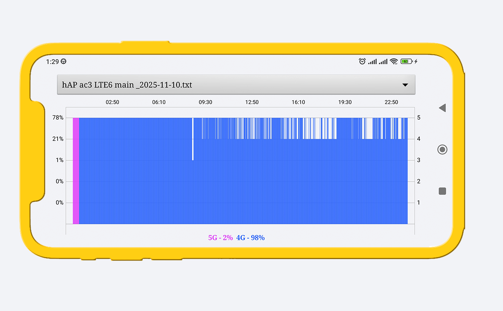

## An application for tracking the history of mobile signal strength and data transmission type (internet). The app records the collected data (per minute) and creates a daily graph from it.

With this app, you can compare how different SIM cards perform under identical conditions or simply check the signal status at any given time during the day.
The application is not a measurement tool.
The data displayed on the graphs is generated based on information received from your device and may differ from actual values.
All information about SIM card performance is stored locally on your phone in text files located in the app's folder. The data is not shared or transmitted anywhere.

#### Data handled by the app:
- Mobile network signal strength.
- Type of data transmission.
- Active SIM card slot number.
- SIM card name.
#### To access such information from your phone, the app requires permission to manage calls.

The app functions as a background service, so for stable and long-term operation, it requires permission to display a persistent notification. It is also recommended to disable battery optimization for the app to ensure uninterrupted activity tracking.

### With this app, you can also display a graph of the signal level and internet type of your MikroTik router with an LTE modem by following this guide.


#### The script has been tested on hAP ac³ LTE6 RouterOS 7.20.4, modem firmware R11e-LTE6_V039.
#### Your router must have the email tool configured (/tool/email).

#### 1. Add a scheduler using terminal command:
```bash
 /system/scheduler/add name=simlogger start-time=startup interval=00:00:55 on-event=simlogger
 ```
#### 2. Create a script named simlogger and add the following code.
Don't forget to specify your email in the script:
```bash
:local toEmail "you@mail.net"
:local MAXMINUTE 1438
:local id [/system/identity/get name]

:local lteData [/interface/lte print as-value]
:local ifaceName ""
:if ([:len $lteData] > 0) do={
    :set ifaceName ([:pick $lteData 0]->"name")
} else={
    :quit
}

:global LTELog
:if ([:len $LTELog] = 0) do={ :set LTELog "" }

:local t [/system/clock/get time]
:local hh [:tonum [:pick $t 0 2]]
:local mi [:tonum [:pick $t 3 5]]
:local minute (($hh * 60) + $mi)

:local mon [/interface/lte monitor $ifaceName once as-value]

:local techRaw ""
:if ([:len ($mon->"access-technology")] > 0) do={
    :set techRaw ($mon->"access-technology")
}

:local tech "xG"

# LTE / 4G variants
:if ($techRaw = "LTE" || \
     $techRaw = "Evolved 3G (LTE)" || \
     $techRaw = "LTE (CA2)" || \
     $techRaw = "LTE-A" || \
     $techRaw = "LTE CA" || \
     $techRaw = "LTE (CA)" || \
     $techRaw = "E-UTRAN" || \
     $techRaw = "Evolved 3G (LTE CA2)") do={
    :set tech "4G"
} else={

    # 5G variants
    :if ($techRaw = "NR5G" || \
         $techRaw = "5G" || \
         $techRaw = "NR") do={
        :set tech "5G"
    } else={

        # 3G variants
        :if ($techRaw = "3G" || \
             $techRaw = "WCDMA" || \
             $techRaw = "UTRAN" || \
             $techRaw = "HSPA" || \
             $techRaw = "HSPA+" || \
             $techRaw = "HSUPA" || \
             $techRaw = "3G HSUPA" || \
             $techRaw = "HSDPA" || \
             $techRaw = "HSDPA & HSUPA" || \
             $techRaw = "HSDPS & HSUPA" || \
             $techRaw = "3G HSDPA & HSUPA" || \
             $techRaw = "3G HSDPS & HSUPA" || \
             $techRaw = "3G HSPA+" || \
             $techRaw = "3G HSDPA") do={
            :set tech "3G"
        } else={

            # 2G variants
            :if ($techRaw = "GSM" || \
                 $techRaw = "GPRS" || \
                 $techRaw = "EDGE" || \
                 $techRaw = "GSM compact" || \
                 $techRaw = "EGPRS") do={
                :set tech "2G"
            }
        }
    }
}

:local lvl -1
:local rsrpStr ""

:if ([:len ($mon->"rsrp")] > 0) do={
    :set rsrpStr ($mon->"rsrp")
} else={
    :if ([:len ($mon->"primary-rsrp")] > 0) do={
        :set rsrpStr ($mon->"primary-rsrp")
    }
}

:local rsrp -140
:if ([:len $rsrpStr] > 0) do={
    :local L [:len $rsrpStr]
    :if ($L > 3 && [:pick $rsrpStr ($L-3) $L] = "dBm") do={
        :set rsrp [:tonum [:pick $rsrpStr 0 ($L-3)]]
    } else={
        :set rsrp [:tonum $rsrpStr]
    }
}

:if ($rsrp > -120) do={
    :if ($rsrp > -80) do={:set lvl 4} else={
        :if ($rsrp > -90) do={:set lvl 3} else={
            :if ($rsrp > -100) do={:set lvl 2} else={
                :if ($rsrp > -110) do={:set lvl 1} else={
                    :set lvl 0
                }
            }
        }
    }
} else={
  :local rssiStr ""
  :if ([:len ($mon->"signal-strength")] > 0) do={
      :set rssiStr ($mon->"signal-strength")
  } else={
      :if ([:len ($mon->"rssi")] > 0) do={
          :set rssiStr ($mon->"rssi")
      }
  }

  :local rssi -140
  :if ([:len $rssiStr] > 0) do={
      :local L [:len $rssiStr]
      :if ($L > 3 && [:pick $rssiStr ($L-3) $L] = "dBm") do={
          :set rssi [:tonum [:pick $rssiStr 0 ($L-3)]]
      } else={
          :set rssi [:tonum $rssiStr]
      }
  }

  :if ($rssi > -65) do={:set lvl 4} else={
      :if ($rssi > -75) do={:set lvl 3} else={
          :if ($rssi > -85) do={:set lvl 2} else={
              :if ($rssi > -95) do={:set lvl 1} else={
                  :if ($rssi > -120) do={:set lvl 0}
              }
          }
      }
  }
}

:global LTELog
:global LTEFileName
:local line ($minute . "," . $tech . "," . $lvl)

:if ($minute < $MAXMINUTE) do={
    :if ($LTELog = "" || [:len $LTELog] = 0) do={
        :set LTELog $line
    } else={
        :set LTELog ($LTELog . "\r\n" . $line)
    }
} else={
    :if ([:len $LTELog] > 0 && $LTELog != "") do={
        :local dateStr [/system/clock/get date]
        :set LTEFileName ($id . "_" . $dateStr . ".txt")
        /file add name=$LTEFileName contents=$LTELog
        /tool e-mail send to=$toEmail subject=("LTE Log for " . $dateStr . " (" . $id . ")") file=$LTEFileName
        :set LTELog ""
    } else={
        :if ([/file find name=$LTEFileName] != "") do={
           /file remove $LTEFileName
        }
    }
}
```
This script queries the LTE modem every 55 seconds for signal level and connection type, and stores the data in a global variable.
- At 23:58, it sends the collected daily statistics to your email as a file.
- At 23:59, it deletes the file from the router after sending it.

#### The filename will consist of the router’s Identity and the current date. You must put this file to your phone in the folder: /Android/data/com.safelogj.simlog/files/ and then open it in the app.


Unless required by applicable law or agreed to in writing, software
distributed under the License is distributed on an "AS IS" BASIS,
WITHOUT WARRANTIES OR CONDITIONS OF ANY KIND, either express or implied.
See the License for the specific language governing permissions and
limitations under the License.
